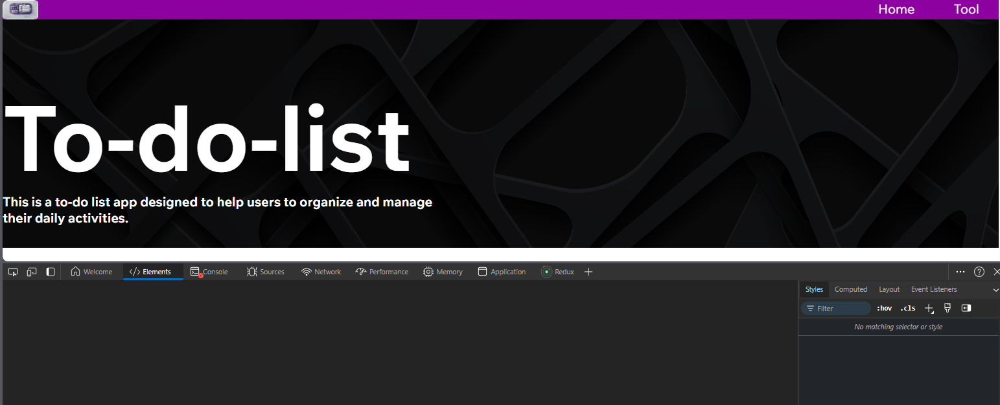
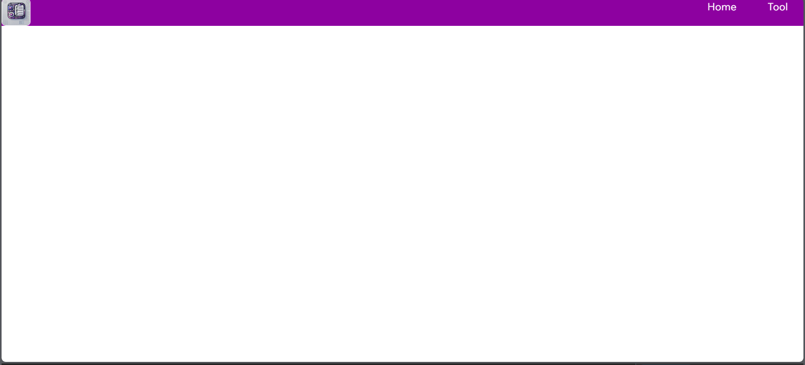
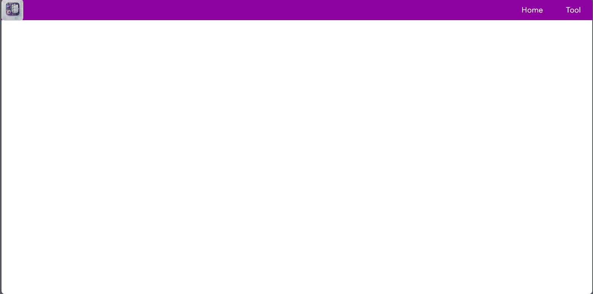

# Cambios que se hicieron en el frontend

1. Cambio de rutas de carpetas de estilos
2. Creacion de carpetas para mayor orden
3. Cambiar clases a ingles
4. Cambio de titulo
5. Creacion de archivo font.css
6. Eliminacion de archivo form.js
7. Agregacion de transition para el boton
8. Arreglando bugs en tools
9. Agregando transines para la navbar
10. Cambiando propiedades de id a clases

## Falta

- Falta arreglar bug de pantalla de carga de tools
- Tabla de responsive

## Cambios de navbar en home

### Antes



### Despues


## Cambios de navbar en tool

### Antes



### Despues



## Medidas responsive para desarrollo web

```css
/* Estilos para móviles pequeños */
@media (max-width: 480px) {
  /* Estilos específicos para pantallas de hasta 480px */
}

/* Estilos para tablets */
@media (min-width: 481px) and (max-width: 768px) {
  /* Estilos específicos para pantallas de 481px a 768px */
}

/* Estilos para pantallas de escritorio pequeñas */
@media (min-width: 769px) and (max-width: 1024px) {
  /* Estilos específicos para pantallas de 769px a 1024px */
}

/* Estilos para pantallas de escritorio medianas */
@media (min-width: 1025px) and (max-width: 1200px) {
  /* Estilos específicos para pantallas de 1025px a 1200px */
}

/* Estilos para pantallas de escritorio grandes */
@media (min-width: 1201px) {
  /* Estilos específicos para pantallas de más de 1200px */
}
```
